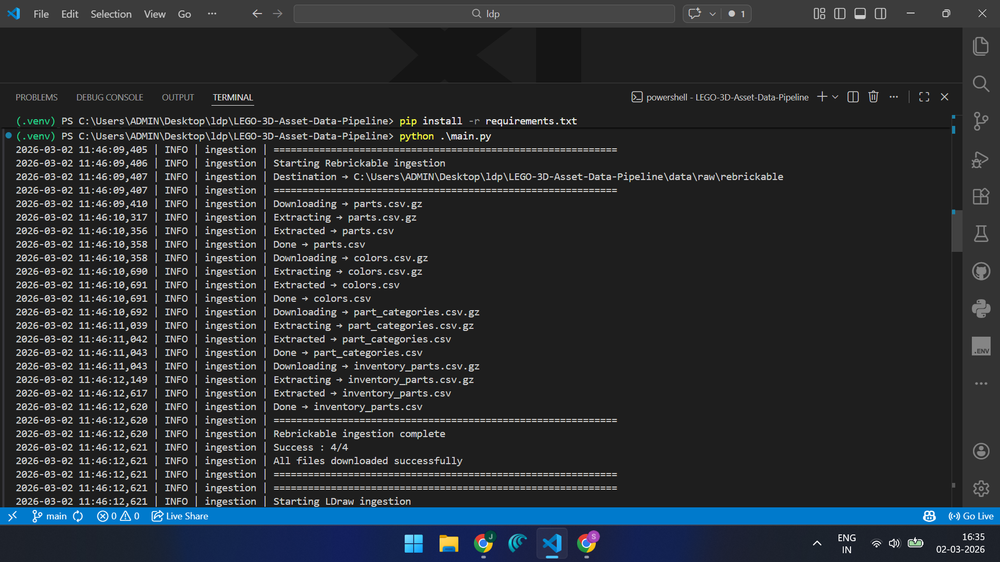
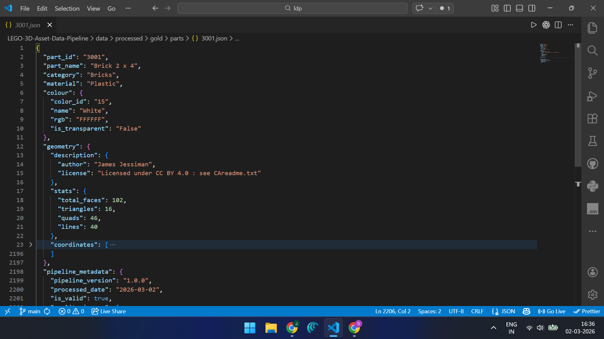
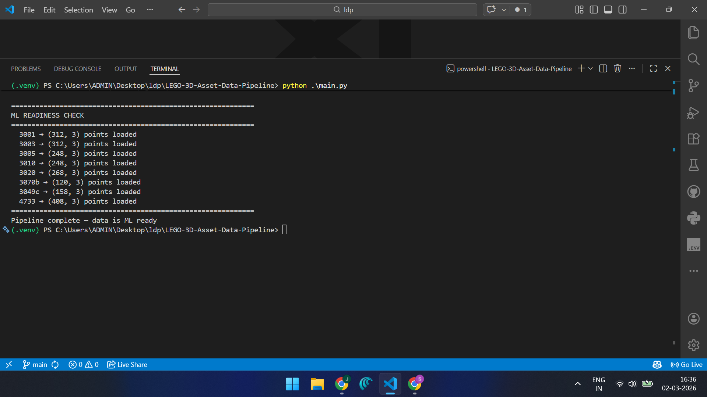
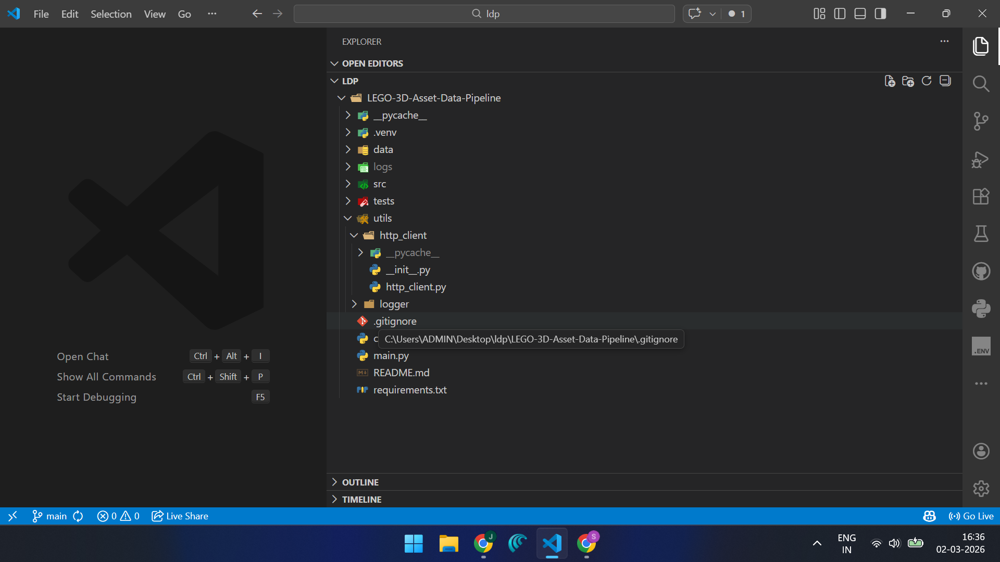

# LEGO 3D Asset Data Pipeline

A production-grade, end-to-end AI data pipeline that ingests raw LEGO 3D geometry and catalogue metadata, processes it through a Medallion architecture (Bronze → Silver → Gold), and delivers clean, validated, enriched datasets ready for AI and machine learning model training.

---

## Problem Statement

AI systems that understand LEGO's design language — how bricks connect, combine, and behave as a system. To train such models, you need a reliable, reproducible, and high-quality dataset of LEGO 3D assets enriched with metadata.

The challenge is that raw LEGO 3D data exists across two separate sources:

- **LDraw** — community-maintained 3D geometry files (`.dat`) for every official LEGO part, using a modular sub-part system where geometry is split across referenced files
- **Rebrickable** — structured catalogue CSVs containing part names, categories, colours, and set inventory data

Neither source alone is sufficient for AI training. This pipeline bridges the gap by ingesting, cleaning, joining, and validating both sources into a single enriched dataset per brick — directly consumable by an ML engineer.

---

## Goal

> Ingest raw LEGO 3D geometry and catalogue data, structure it through a Medallion architecture, validate and enrich it, and deliver a versioned JSON dataset per brick that is immediately consumable for AI model training.

---

## Datasets

| Source | What It Provides | Format |
|--------|-----------------|--------|
| [LDraw.org](https://library.ldraw.org) | 3D geometry — vertices, faces, sub-part references | `.dat` files |
| [Rebrickable](https://rebrickable.com/downloads/) | Part names, categories, colours, set inventory | `.csv.gz` files |

Both datasets are free and publicly available. This pipeline downloads them automatically.

**Parts processed in this demo (8 parts):**

| Part ID | Name |
|---------|------|
| 3001 | Brick 2x4 |
| 3003 | Brick 2x2 |
| 3005 | Brick 1x1 |
| 3010 | Brick 1x4 |
| 3020 | Plate 2x4 |
| 3070b | Tile 1x1 |
| 3049c | Slope |
| 4733 | Brick with Studs |

---

## Prerequisites

- Python 3.10+
- pip
- Internet connection (for first run — downloads ~170MB LDraw library)

---

## Setup & Run

**1. Clone the repository**
```bash
git clone https://github.com/carzy-zala/LEGO-3D-Asset-Data-Pipeline.git
cd LEGO-3D-Asset-Data-Pipeline
```

**2. Create virtual environment**
```bash
python -m venv .venv
```

**3. Activate virtual environment**
```bash
# Windows
.venv\Scripts\activate

# macOS / Linux
source .venv/bin/activate
```

**4. Install dependencies**
```bash
pip install -r requirements.txt
```

**5. Run the full pipeline**
```bash
python main.py
```
## Pipeline Output

### Pipeline Run


### Gold Output


### ML Readiness


### Folder Strcture After Run

---

## Project Structure

```
lego-ai-pipeline/
│
├── main.py                          ← Entry point — runs full pipeline
├── config.py                        ← Central config — all paths and constants
├── requirements.txt
├── .gitignore
├── README.md
│
├── data/                            ← Auto-created on run (gitignored)
│   ├── raw/
│   │   ├── ldraw/                   ← Raw .dat files
│   │   │   └── library/             ← Full LDraw library for sub-part resolution
│   │   │       ├── parts/           ← All official parts
│   │   │       │   └── s/           ← Sub-parts
│   │   │       └── p/               ← Primitives
│   │   └── rebrickable/             ← Raw Rebrickable CSVs
│   └── processed/
│       ├── bronze/
│       │   ├── geometry/            ← Parsed LDraw geometry CSVs
│       │   └── catalogue/           ← Filtered Rebrickable CSVs
│       ├── silver/
│       │   ├── ldraw/               ← Validated geometry CSVs
│       │   └── rebrickable/         ← Merged catalogue CSV
│       └── gold/
│           ├── parts/               ← One enriched JSON per part
│           └── manifest.json        ← Full dataset index
│
├── src/
│   ├── ingestion/
│   │   ├── rebrickable.py           ← Downloads and extracts Rebrickable CSVs
│   │   └── ldraw.py                 ← Downloads LDraw files + full library
│   │
│   ├── transformation/
│   │   ├── bronze/
│   │   │   ├── ldraw/
│   │   │   │   ├── src/
│   │   │   │   │   ├── DS2B_ldraw.py         ← .dat parser with sub-part resolution
│   │   │   │   │   └── DS2B_ldraw_job.py     ← iterates parts, writes CSVs
│   │   │   │   └── config/
│   │   │   │       └── DS2B_ldraw_config.json
│   │   │   └── rebrickable/
│   │   │       ├── src/
│   │   │       │   ├── DS2B_rebrickable.py       ← filter logic
│   │   │       │   └── DS2B_rebrickable_job.py   ← iterates CSVs, writes output
│   │   │       └── config/
│   │   │           └── DS2B_rebrickable_config.json
│   │   │
│   │   ├── silver/
│   │   │   ├── ldraw/
│   │   │   │   ├── src/
│   │   │   │   │   ├── B2S_ldraw.py              ← validation logic
│   │   │   │   │   └── B2S_ldraw_job.py          ← runs validation, writes CSVs
│   │   │   │   └── config/
│   │   │   │       └── B2S_ldraw_config.json
│   │   │   └── rebrickable/
│   │   │       ├── src/
│   │   │       │   ├── B2S_rebrickable.py        ← merge + validate logic
│   │   │       │   └── B2S_rebrickable_job.py    ← runs merge, writes output
│   │   │       └── config/
│   │   │           └── B2S_rebrickable_config.json
│   │   │
│   │   └── gold/
│   │       ├── src/
│   │       │   ├── S2G_gold.py          ← join + enrich logic
│   │       │   └── S2G_gold_job.py      ← iterates parts, writes JSON + manifest
│   │       └── config/
│   │           └── S2G_gold_config.json
│   │
│   └── ml_ready/
│       └── data_loader.py           ← converts gold JSON to numpy point clouds
│
├── utils/
│   ├── logger/
│   │   └── __init__.py              ← centralised logger with get_logger()
│   └── http_client/
│       └── __init__.py              ← centralised HTTP client
│
├── tests/
│   ├── src/
│   │   ├── ingestion/               ← ingestion tests
│   │   └── transformation/
│   │       ├── bronze/              ← bronze layer tests
│   │       ├── silver/              ← silver layer tests
│   │       └── gold/                ← gold layer tests
│   └── utils/
│       ├── logger/                  ← logger tests
│       └── http_client/             ← http client tests
│
└── logs/                            ← Auto-created on run (gitignored)
    ├── ingestion/
    ├── bronze/
    ├── silver/
    └── gold/
```

---

## Architecture

```
SOURCE 1                    SOURCE 2
LDraw.org                   Rebrickable
.dat files                  .csv.gz files
(3D geometry)               (catalogue metadata)
     |                            |
     └──────── INGESTION ─────────┘
                    |
             data/raw/
                    |
           ── BRONZE LAYER ──
           DS2B: Data Source to Bronze
           • LDraw  → geometry_description.csv
                    + geometry_coordinates.csv
           • Rebrickable → 4 filtered CSVs
                    |
           ── SILVER LAYER ──
           B2S: Bronze to Silver
           • LDraw  → validate coordinates
                       flag is_valid + issues per row
           • Rebrickable → join 4 CSVs into
                           single enriched catalogue
                    |
           ── GOLD LAYER ──
           S2G: Silver to Gold
           • Join LDraw + Rebrickable on part_num
           • Build nested JSON per part
           • Write manifest.json
                    |
           data/processed/gold/
           3001.json, 3003.json ...
                    |
           ── ML READY ──
           numpy point cloud arrays
           shape (N, 3) — ready for AI training
```

---

## Pipeline Flow — Layer by Layer

### Ingestion
- `rebrickable.py` downloads 4 CSV files from `cdn.rebrickable.com`, extracts `.gz` archives, and saves to `data/raw/rebrickable/`
- `ldraw.py` downloads the complete LDraw parts library (~170MB zip), extracts the 8 target `.dat` files to `data/raw/ldraw/`, and keeps the full `parts/` and `p/` library at `data/raw/ldraw/library/` for sub-part resolution. The zip is deleted after extraction to save disk space

### Bronze — DS2B (Data Source to Bronze)
- **LDraw**: `DS2B_ldraw.py` parses each `.dat` file line by line. Line type `0` extracts metadata (name, author, license). Line types `2`, `3`, `4` extract geometry coordinates. Line type `1` sub-part references are resolved recursively against the full LDraw library so all nested geometry is captured. Output is two CSVs — `geometry_description.csv` (one row per part) and `geometry_coordinates.csv` (one row per geometry line)
- **Rebrickable**: `DS2B_rebrickable.py` reads each CSV, keeps only required columns defined in `DS2B_rebrickable_config.json`, and filters rows to the 8 target parts where applicable

### Silver — B2S (Bronze to Silver)
- **LDraw**: `B2S_ldraw.py` validates every row in both geometry CSVs. Checks include valid line types, correct vertex count per line type, non-null required coordinates, and numeric coordinate values. Each row gets `is_valid` and `issues` columns — invalid rows are flagged but never dropped, preserving full data lineage
- **Rebrickable**: `B2S_rebrickable.py` joins all 4 bronze CSVs into a single enriched catalogue driven entirely by join definitions in `B2S_rebrickable_config.json`. Validates required columns, null values, and material types

### Gold — S2G (Silver to Gold)
- `S2G_gold.py` joins LDraw and Rebrickable silver outputs on `part_num`, builds a nested JSON per part with geometry stats (total faces, triangles, quads, lines), colour information, and full pipeline metadata
- `S2G_gold_job.py` iterates all 8 parts, writes one `{part_id}.json` to `data/processed/gold/parts/`, and generates a `manifest.json` summarising the entire dataset with validity counts

### ML Ready
- `data_loader.py` reads any gold JSON and converts its geometry coordinates into a `numpy` array of shape `(N, 3)` representing N vertices with x, y, z values — directly consumable by a PyTorch or TensorFlow dataset class

---

## Gold Output — Sample

```json
{
  "part_id": "3001",
  "part_name": "Brick  2 x  4",
  "category": "Brick",
  "material": "Plastic",
  "colour": {
    "color_id": "4",
    "name": "Red",
    "rgb": "B40000",
    "is_transparent": "f"
  },
  "geometry": {
    "description": {
      "author": "James Jessiman",
      "license": "Licensed under CC BY 4.0 : see CAreadme.txt"
    },
    "stats": {
      "total_faces": 104,
      "triangles": 0,
      "quads": 104,
      "lines": 0
    },
    "coordinates": [...]
  },
  "pipeline_metadata": {
    "pipeline_version": "1.0.0",
    "processed_date": "2026-02-28",
    "is_valid": true,
    "quality_issues": []
  }
}
```

---

## ML Readiness Check

After the pipeline completes, the ML readiness check confirms every part is loadable as a numpy point cloud:

```
============================================================
ML READINESS CHECK
============================================================
  3001 → (312, 3) points loaded
  3003 → (312, 3) points loaded
  3005 → (248, 3) points loaded
  3010 → (248, 3) points loaded
  3020 → (268, 3) points loaded
  3070b → (120, 3) points loaded
  3049c → (158, 3) points loaded
  4733 → (408, 3) points loaded
============================================================
Pipeline complete — data is ML ready
```

Each tuple `(N, 3)` represents N vertices with x, y, z coordinates — the exact input format expected by 3D ML models such as PointNet.

---

## Running Tests

Tests cover core logic functions across all pipeline layers and utilities.

```bash
# Run all tests
pytest tests/

# Run by layer
pytest tests/src/transformation/bronze/
pytest tests/src/transformation/silver/
pytest tests/src/transformation/gold/

# Run ingestion tests
pytest tests/src/ingestion/

# Run utility tests
pytest tests/utils/

# Verbose output
pytest tests/ -v


---

## Logging

Every pipeline stage writes structured logs automatically to `logs/` (gitignored):

```
logs/
├── ingestion/
│   ├── ingestion.log     ← download progress, file sizes
│   └── ingestion_error.log    ← failed downloads
├── bronze/
│   ├── bronze.log     ← rows parsed per part
│   └── bronze_error.log    ← parse failures
├── silver/
│   ├── silver.log     ← validation results per part
│   └── silver_error.log    ← invalid rows flagged
└── gold/
    ├── gold.log     ← JSON written per part
    └── gold_error.log    ← join or build failures
```

---

## Known Limitations

LDraw `.dat` files use a modular sub-part system where geometry is distributed across referenced files via line type `1`. This pipeline resolves sub-part references recursively using the full LDraw library extracted at `data/raw/ldraw/library/`. Primitives nested more than 3 levels deep may not be fully resolved in edge cases — this is a known extension point for production scale pipelines.

---

## Tech Stack

| Tool | Purpose |
|------|---------|
| Python 3.10+ | Core pipeline language |
| Pandas | CSV processing and joins |
| NumPy | Point cloud conversion for ML |
| Requests | HTTP client for downloads |
| Pytest | Unit testing |
| Pathlib | Cross-platform path handling |
